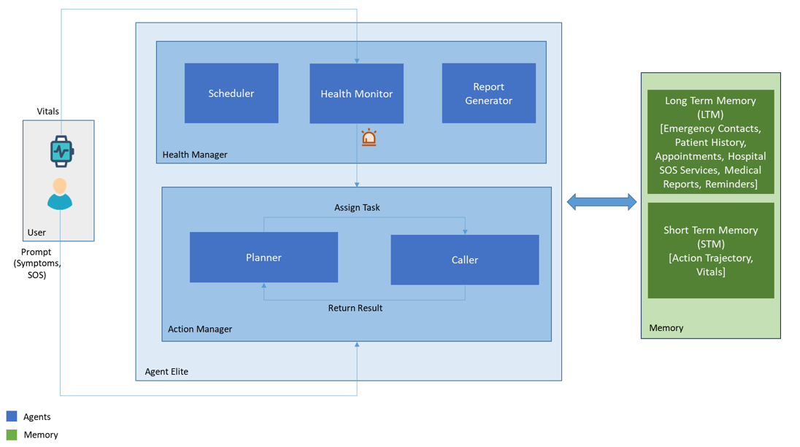
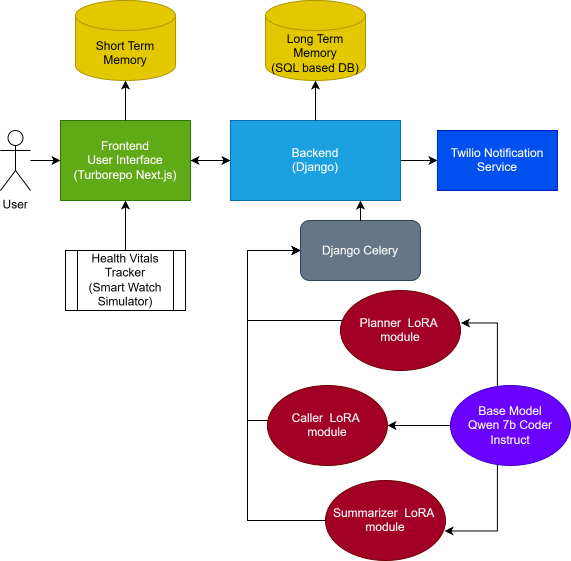

# Healthcare LAMAgents

## Overview



Healthcare applications require handling sensitive
personal data, ensuring real-time responsiveness,
and maintaining uninterrupted functionality,
even in offline scenarios. Cloud-based solutions,
while powerful, are often constrained by privacy
risks, latency issues, and dependency on continuous
internet access.execute complex tasks
by dividing them into modular, agent-specific components.

Large Action Models (LAMs) have emerged as
a groundbreaking paradigm in intelligent automation,
enabling systems to to execute complex tasks
by dividing them into modular, agent-specific components. The computational limitations of edge devices
pose a significant challenge when deploying large,
monolithic models

By utilizing
smaller, task-specific agents, we can effectively
distribute workloads. This leads to optimized
resource allocation, where compact models are
designed to operate within the constraints of edge
devices, ensuring efficient use of available computational
resources. 

Moreover, the system’s functionality
can be easily scaled by introducing additional
agents, allowing for incremental growth
and adaptation. This setup fosters modular collaboration,
where each agent functions independently,
focusing on its specific task, while also working
in harmony with others to manage more complex
workflows.




## Use cases
- Schedule a doctor's appointment.
- Trigger emergency SoS to the nearest hospital and family members.
- Health Monitor by fetching vitals from smart devices
- Generate weekly report on the basis of health vitals.
- Schedule reminders just by uploading your prescription.
## Installation

### Frontend
1. Installing dependencies

    NPM:```npm install```

    Yarn: ```yarn install```

    PNPM (Recommended): ```pnpm install```
2. Building the project
    NPM:```npm run build```

    Yarn: ```yarn run build```

    PNPM: ```pnpm run build```

3. Serving the project

    NPM:```npm run dev```

    Yarn: ```yarn run dev```

    PNPM: ```pnpm run dev```
### Backend
1. Installation
    ```pip install -r requirements.txt```
2. Check views.py for caller and planner model path and change it according to your paths as needed (.elite/elitepi/views.py)
3. Create a Twilio account and added the credentials in env variable to send notificaitons SMS
4. Running the server 
    ```python manage.py runserver```

## Demo Video
[](https://www.youtube.com/watch?v=yAynmPSm_G8)

## Report
@misc{gawade2025multiagentbasedmedical,
      title={Multi Agent based Medical Assistant for Edge Devices}, 
      author={Sakharam Gawade and Shivam Akhouri and Chinmay Kulkarni and Jagdish Samant and Pragya Sahu and Aastik and Jai Pahal and Saswat Meher},
      year={2025},
      eprint={2503.05397},
      archivePrefix={arXiv},
      primaryClass={cs.MA},
      url={https://arxiv.org/abs/2503.05397}, 
}
